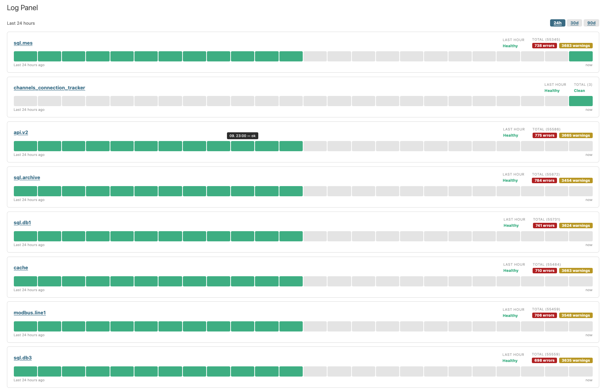
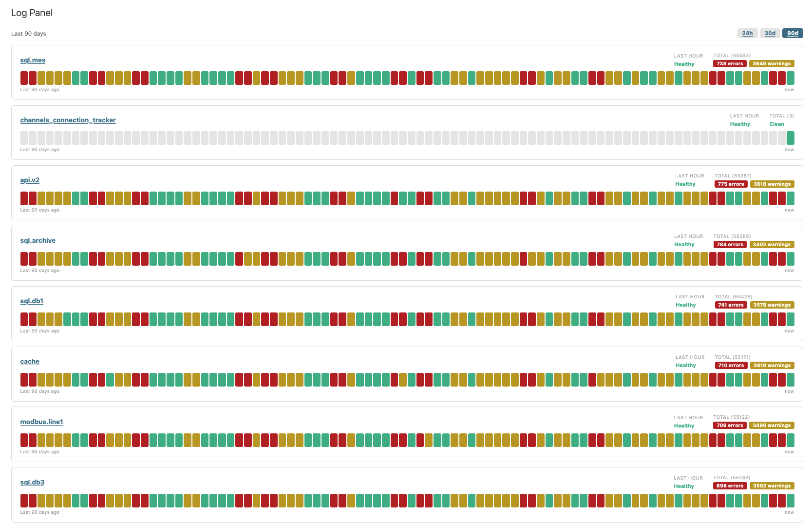
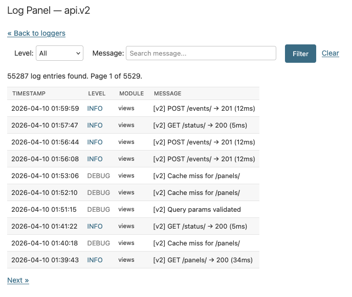
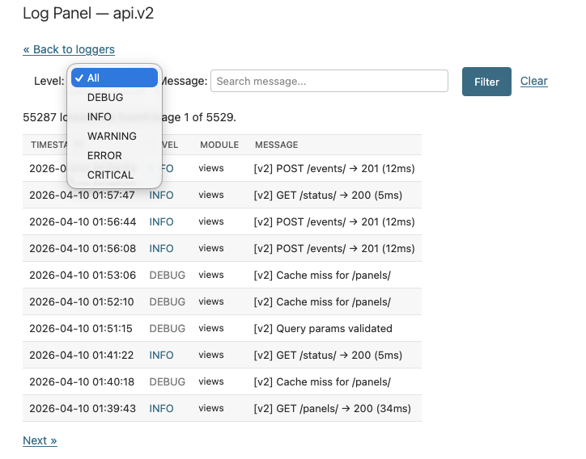

# Django Log Panel

[](https://pypi.org/project/django-log-panel/)
[](https://djangopackages.org/packages/p/django-log-panel/)

`django-log-panel` displays your Django logs inside Django admin as a per-logger status dashboard with searchable log entries and optional threshold alerts, without a separate service to run.

<p align="center">
  <a href="images/main.png">
    
  </a>
</p>

<p align="center">
  <a href="images/main_2.png">
    
  </a>
</p>

<p align="center">
  <a href="images/filter.png">
    
  </a>
  <a href="images/filter_2.png">
    
  </a>
</p>

## Features

- A status-page style dashboard in Django admin, with one health card per logger.
- A searchable, filterable log table for drilling into individual entries.
- MongoDB and SQL storage backends, depending on how you want to store logs.
- Threshold alerts through a Django signal that your application can react to.
- Configurable ranges, colors, page size, title, and access control.
- Automatic root-handler setup by default, with manual `LOGGING` control when needed.

## Requirements

- Python >= 3.12
- Django >= 5.2
- `django-mongodb-backend` *only when using the MongoDB backend (version must match your Django version, e.g. 5.2.x for Django 5.2, 6.0.x for Django 6.0)*
- A running, reachable MongoDB instance *when using the MongoDB backend*

## Installation

=== "uv"

    ```bash
    uv add django-log-panel
    ```

=== "pip"

    ```bash
    pip install django-log-panel
    ```

For MongoDB support, install the optional extra:

=== "uv"

    ```bash
    uv add "django-log-panel[mongodb]"
    ```

=== "pip"

    ```bash
    pip install "django-log-panel[mongodb]"
    ```

## Choose a backend

| Backend | Use it when | Retention | Extra setup |
| ------- | ----------- | --------- | ----------- |
| MongoDB | You want append-only logging with cheap writes and flexible document storage. | Run the `delete_old_logs` management command on a schedule. | Install the `mongodb` extra, add a `DATABASES` entry with `ENGINE` `"django_mongodb_backend"`, and set `DATABASE_ALIAS`. |
| SQL | You want logs in a Django-managed relational database. | Run the `delete_old_logs` management command on a schedule. | Add `LogsRouter`, point `DATABASE_ALIAS` at the target database, and run the `log_panel` migration on that alias. |

Both backends use the same `Log` model, `DatabaseHandler`, and ORM queries. The only difference is the `ENGINE` in your `DATABASES` entry.

## Quick start

### 1. Add the app

```python
INSTALLED_APPS = [
    ...,
    "log_panel",
]
```

### 2. Configure one backend

=== "MongoDB"

    ```python
    DATABASES["logs"] = {
        "ENGINE": "django_mongodb_backend",
        "HOST": "mongodb://localhost:27017",
        "NAME": "myapp_logs",
    }

    DATABASE_ROUTERS = [
        "log_panel.routers.LogsRouter",
    ]

    LOG_PANEL = {
        "DATABASE_ALIAS": "logs",
        "TTL_DAYS": 90,
    }
    ```

=== "SQL"

    ```python
    DATABASES["logs"] = {
        "ENGINE": "django.db.backends.postgresql",
        "NAME": "myapp_logs",
        "USER": "...",
        "PASSWORD": "...",
        "HOST": "...",
        "PORT": "...",
    }

    DATABASE_ROUTERS = [
        "log_panel.routers.LogsRouter",
    ]

    LOG_PANEL = {
        "DATABASE_ALIAS": "logs",
        "TTL_DAYS": 90,
    }
    ```

Then run the migration on the logging database:

```bash
python manage.py migrate log_panel --database=logs
```

### 3. Open Django admin

Go to **Application Logs**, or open:

```
/admin/log_panel/panel/
```

Once configured, any standard Python logger that flows through the selected handler will show up in the panel.

## How log capture works

- `LOG_PANEL` selects how the admin reads log data.
- By default, `log_panel` auto-attaches a `DatabaseHandler` to the root logger at startup.
- Set `ATTACH_ROOT_HANDLER = False` when you want full control through Django `LOGGING`.
- `LOG_LEVEL` only affects the auto-attached root handler.
- Stored fields come from the log record itself; `LOGGING` formatters do not reshape the stored data.

Full setup notes and manual `LOGGING` examples are in the [backend guide](backends.md).

## What's next?

- [Configuration reference](configuration.md) — all `LOG_PANEL` settings explained
- [Backend setup](backends.md) — MongoDB and SQL details, manual `LOGGING` examples
- [Advanced topics](advanced.md) — alerts, buffering, retention cleanup, admin UI
- [API reference](reference/log_panel/index.md) — auto-generated module docs
